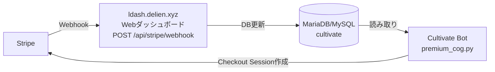

# Stripe Webhook 受信サーバー仕様書

**ステータス**: 設計案（レビュー待ち）→ **保留**
**対象リポジトリ**: 別リポジトリ（Webダッシュボード側）
**Webhook URL（予定）**: `https://ldash.delien.xyz/api/stripe/webhook`
**関連ファイル**: `utils/system_cogs/premium_cog.py`（Bot側・現行実装）

> **※ 重要（2026/08/09）**:
> 現時点では **Bot完結の定期ポーリング方式（5分毎）** を採用しており、
> Webhookサーバーは Bot から削除された。本仕様書は将来
> ダッシュボードへ移管する際の参考として残している。
> ポーリング方式の実装は `premium_cog.py` の
> `get_all_subscriptions()` / `_poll_subscriptions_sync()` を参照。

---

## 1. 概要

Discord Bot「Cultivate」のプレミアム契約機能（Stripe サブスクリプション）において、
Stripe から送信される Webhook イベントを受信・検証し、契約状態をデータベースに
反映するための HTTP サーバーを提供する。

現在は Bot 本体（premium_cog.py）が aiohttp で Webhook サーバーを内蔵しているが、
これを廃止し、**Web ダッシュボード（ldash.delien.xyz）側に移管**する。
Bot 本体は Webhook 受信を行わない（または無効化する）。

### 1.1 システム構成



- **Stripe** → Webhook イベントを送信
- **Web ダッシュボード** → 署名検証・イベント処理・DB 更新を実施
- **DB** → Bot と Web ダッシュボードが共有（既存の `cultivate` データベース）
- **Bot** → 契約状態を DB から読み取り、パネル表示・サーバー有効化判定を行う

### 1.2 移管の背景

| 項目 | 現行（Bot内蔵） | 移管後（ダッシュボード） |
| --- | --- | --- |
| 受信URL | `POST /stripe/webhook` | `POST /api/stripe/webhook` |
| ポート | 8745（Botの公開ポート） | 443（HTTPS標準） |
| 署名検証 | premium_cog.py 内 | ダッシュボード内 |
| DB更新 | premium_cog.py 内 | ダッシュボード内 |
| Botの負荷 | 常時受信待機 | なし（0） |

---

## 2. エンドポイント仕様

### 2.1 基本情報

| 項目 | 値 |
| --- | --- |
| メソッド | `POST` |
| パス | `/api/stripe/webhook` |
| Content-Type | `application/json` |
| 認証 | Stripe-Signature ヘッダによる署名検証（必須） |

### 2.2 リクエスト

```
POST /api/stripe/webhook HTTP/1.1
Host: ldash.delien.xyz
Content-Type: application/json
Stripe-Signature: t=1725000000,v1=5256a6f3a2c4d1e2...,v0=...
```

- ボディは Stripe Event オブジェクト（JSON）の **raw ボディ**（加工しない）
- `Stripe-Signature` ヘッダにタイムスタンプ `t=` と署名 `v1=` が含まれる

### 2.3 レスポンス

| ケース | HTTPステータス | ボディ |
| --- | --- | --- |
| 処理成功 | `200 OK` | 任意（例: `processed: checkout.session.completed`） |
| 署名検証失敗 | `400 Bad Request` | エラーメッセージ |
| シークレット未設定 | `400 Bad Request` | エラーメッセージ |
| 未知のイベント | `200 OK` | `processed: <event_type>`（無視して成功扱い） |

**重要**: Stripe は 2xx 以外のレスポンスを受け取ると再送する。
未知のイベント種別であっても 200 を返すこと（既知の3種以外は無視）。

---

## 3. 署名検証

### 3.1 必須処理

受信した raw ボディ・`Stripe-Signature` ヘッダ・Webhook シークレットを使って
**必ず署名検証を行う**。検証失敗時は必ず `400` を返し、処理を中断する。

```python
import stripe

event = stripe.Webhook.construct_event(
    payload,           # raw ボディ（bytes）
    sig_header,        # Stripe-Signature ヘッダ値
    webhook_secret,    # whsec_... 形式の署名シークレット
)
# 検証失敗時は stripe.error.SignatureVerificationError が送出される
```

- 検証成功後、`event["type"]` と `event["data"]["object"]` を参照する
- タイムスタンプの許容差（tolerance）はデフォルト（300秒）で問題ない

### 3.2 シークレットの管理

- Webhook シークレット（`whsec_...`）は**環境変数**で管理する
  （例: `STRIPE_WEBHOOK_SECRET`）
- ソースコード・リポジトリにコミットしない
- テスト環境と本番環境で別のシークレットを使用する

---

## 4. イベント処理仕様

購読対象イベントは以下の **3 種のみ**。

| イベント種別 | 処理概要 |
| --- | --- |
| `checkout.session.completed` | 契約情報の仮登録（status=incomplete） |
| `customer.subscription.updated` | 契約状態・プラン・期限の確定反映 |
| `customer.subscription.deleted` | 解約（置き換え判定あり） |

### 4.1 共通: プラン定義と状態

```python
PLAN_SILVER = "silver"    # シルバー: サーバー上限 1台
PLAN_GOLD = "gold"        # ゴールド: サーバー上限 3台
PLAN_DIAMOND = "diamond"  # ダイヤモンド: サーバー上限 5台

# プレミアム有効とみなす Stripe 状態
_ACTIVE_STATUSES = {"active", "trialing", "past_due"}
```

- `active` / `trialing` / `past_due` → 契約有効（サーバー有効化を維持）
- `canceled` / `incomplete` / `unpaid` → 契約無効（全サーバー解除）
- プラン変更時、上限を超えた有効化は **activated_at の古い順に解除**する

### 4.2 商品名からのプラン判定（`_detect_plan_from_name`）

Stripe の商品名（Product name）からプラン種別を判定する。

```python
def detect_plan_from_name(name: str) -> str:
    """Stripe商品名からプラン種別を判定する"""
    if "ダイヤモンド" in name:
        return "diamond"
    if "ゴールド" in name:
        return "gold"
    return "silver"  # 不明な場合はシルバー扱い
```

判定順序は **ダイヤモンド → ゴールド → シルバー（デフォルト）**。
商品名に「ダイヤモンド」「ゴールド」「シルバー」を含めること。

### 4.3 `checkout.session.completed`

**目的**: 支払いセッション完了時に契約情報を仮登録する。
**status は `incomplete` で保存**（最終確定は subscription.updated が担当）。

処理手順:

1. `user_id` を取得する。優先順は以下の通り:
   - `session.client_reference_id`
   - `session.metadata.discord_user_id`
   - どちらも無効なら処理を中断（ログ出力のみ）
2. `session.subscription` が無い場合は処理を中断（サブスク以外のCheckout）
3. `session.metadata.plan` からプラン種別を復元
   （`PLANS` に無い値はシルバーにフォールバック）
4. `session.customer`（customer ID）を取得
5. 同じ customer ID の既存契約（`premium_subscriptions`）を検索
6. **契約情報を upsert する**（status=`incomplete`）:
   - `user_id`, `plan_type`, `stripe_customer_id`, `stripe_subscription_id`
7. **プラン変更対応**: 同一ユーザーの旧アクティブ契約があれば
   Stripe 側でキャンセルする:
   - 旧契約の `stripe_subscription_id` が新契約と異なり、
     旧 status が有効系（active/trialing/past_due）の場合
   - `stripe.Subscription.cancel(old_sub_id)` を実行
   - Stripe API エラーはログ出力のみで握りつぶす（新契約は不影響）

### 4.4 `customer.subscription.updated`

**目的**: 契約状態・プラン・期限の変更を反映する（最重要イベント）。

処理手順:

1. `subscription.id` から DB の契約行を検索
   - `stripe_subscription_id` で検索
   - 見つからない場合は `subscription.customer`（customer ID）で再検索
   - どちらも見つからない場合はログ出力のみで終了
2. `user_id` を特定
3. **プラン種別の判定**（優先順）:
   - ① `subscription.metadata.plan`
   - ② items 内の `price.product.name`（商品名）
     - 商品情報がインライン展開（dict）されている場合のみ
   - 判定は `detect_plan_from_name()` を使用
4. `current_period_end`（Unix 秒）を `expires_at`（DATETIME）に変換
5. **契約情報を upsert する**:
   - `plan_type`, `status`, `stripe_customer_id`,
     `stripe_subscription_id`, `expires_at`
6. **status が有効系でない場合**:
   - ユーザーの全サーバー有効化を解除（`premium_activations` から削除）
   - 解除した各サーバーのアナリティクス premium フラグを OFF にする
7. **status が有効系の場合**:
   - 有効化数が新プラン上限を超えていれば **超過分を古い順に解除**
     （例: ダイヤモンド5台 → シルバー1台 変更時は4台解除）

### 4.5 `customer.subscription.deleted`

**目的**: 解約処理。ただしプラン変更による置き換え削除を考慮する。

処理手順:

1. `subscription.id` から DB の契約行を検索（無ければ終了）
2. `user_id` を特定
3. **置き換え判定**:
   - 同じ `user_id` の現在の契約（`premium_subscriptions`）を確認
   - 現在の契約の `stripe_subscription_id` が削除対象と**異なり**、
     かつ現在の契約の status が有効系の場合 → **プラン変更の置き換え**とみなす
4. 削除対象の契約を status=`canceled` で upsert
5. **置き換えの場合**: 有効化を維持して終了（新契約が継続中）
6. **置き換えでない場合**:
   - 全サーバー有効化を解除
   - 解除した各サーバーのアナリティクス premium フラグを OFF

### 4.6 アナリティクス連携（`analytics_settings.premium`）

サーバー有効化の解除時、以下のフラグを更新する。

- 対象テーブル: `analytics_settings`
- 対象カラム: `settings_json` 内の `premium` フィールド（`true`/`false`）
- 更新タイミング: 有効化解除時のみ（有効化は Bot の `/プレミアム管理` が担当）

```sql
-- 例: 有効化解除時の premium フラグ OFF
UPDATE analytics_settings
SET settings_json = JSON_SET(
        settings_json, '$.premium', false
    )
WHERE guild_id = %s;
```

> **注意（重要）**: Bot 側の `analytics_cog.py` は `_SETTINGS_CACHE`
> （メモリキャッシュ）を持つ。DB を直接更新しただけでは Bot の
> メモリ上のキャッシュが更新されないため、整合性の取り方を
> **§7 連携方式**で設計する必要がある。

---

## 5. データベース仕様

### 5.1 接続情報

Bot と共有する既存の MariaDB/MySQL データベースを使用する。

| 項目 | 値（例） |
| --- | --- |
| ホスト | 既存の DB ホスト（Bot と同じ） |
| ポート | 既存の DB ポート（Bot と同じ） |
| データベース | `cultivate` |
| 文字コード | `utf8mb4` |

- 接続情報は環境変数で管理する（リポジトリにコミットしない）
- **テーブルは Bot 側の `premium_cog.py` が既に作成済み**のため、
  ダッシュボード側での CREATE は不要（IF NOT EXISTS で再作成しても安全）

### 5.2 `premium_subscriptions`（契約）

1ユーザー1行。Stripe サブスクリプションの状態を保持する。

```sql
CREATE TABLE IF NOT EXISTS premium_subscriptions (
    user_id BIGINT NOT NULL,
    plan_type VARCHAR(20) NOT NULL,
    status VARCHAR(20) NOT NULL DEFAULT 'incomplete',
    stripe_customer_id VARCHAR(100) DEFAULT NULL,
    stripe_subscription_id VARCHAR(100) DEFAULT NULL,
    started_at DATETIME DEFAULT NULL,
    expires_at DATETIME DEFAULT NULL,
    updated_at DATETIME
        DEFAULT CURRENT_TIMESTAMP
        ON UPDATE CURRENT_TIMESTAMP,
    PRIMARY KEY (user_id),
    INDEX idx_stripe_sub (stripe_subscription_id)
) ENGINE=InnoDB DEFAULT CHARSET=utf8mb4
```

**upsert パターン**（新規挿入 or 既存更新）:

```sql
INSERT INTO premium_subscriptions
    (user_id, plan_type, status,
     stripe_customer_id, stripe_subscription_id,
     started_at, expires_at)
VALUES (%s, %s, %s, %s, %s, NOW(), %s)
ON DUPLICATE KEY UPDATE
    plan_type = VALUES(plan_type),
    status = VALUES(status),
    stripe_customer_id = VALUES(stripe_customer_id),
    stripe_subscription_id = VALUES(stripe_subscription_id),
    expires_at = VALUES(expires_at)
```

### 5.3 `premium_activations`（サーバー有効化）

1ユーザー × 1サーバー。契約者が有効化した Discord サーバーの一覧。

```sql
CREATE TABLE IF NOT EXISTS premium_activations (
    user_id BIGINT NOT NULL,
    guild_id BIGINT NOT NULL,
    activated_at DATETIME DEFAULT CURRENT_TIMESTAMP,
    PRIMARY KEY (user_id, guild_id),
    INDEX idx_guild (guild_id)
) ENGINE=InnoDB DEFAULT CHARSET=utf8mb4
```

**解除時は有効化の古い順（activated_at ASC）で取得し、上限超過分を削除する。**

### 5.4 使用する SQL パターン一覧

| 用途 | SQL 概要 |
| --- | --- |
| 契約取得（stripe sub ID） | `SELECT * FROM premium_subscriptions WHERE stripe_subscription_id = %s LIMIT 1` |
| 契約取得（customer ID） | `SELECT * FROM premium_subscriptions WHERE stripe_customer_id = %s LIMIT 1` |
| 契約取得（user_id） | `SELECT * FROM premium_subscriptions WHERE user_id = %s` |
| 契約保存 | 上記 INSERT ... ON DUPLICATE KEY UPDATE |
| 有効化一覧 | `SELECT * FROM premium_activations WHERE user_id = %s ORDER BY activated_at ASC` |
| 有効化解除（1件） | `DELETE FROM premium_activations WHERE user_id = %s AND guild_id = %s` |
| 有効化全解除 | `DELETE FROM premium_activations WHERE user_id = %s` |
| premium フラグ OFF | §4.6 参照 |

---

## 6. セキュリティ要件

1. **署名検証は必須**（§3）。`Stripe-Signature` ヘッダがない・検証失敗
   のリクエストは必ず `400` を返す
2. Webhook シークレット・DB 接続情報・Stripe API キーは
   **環境変数**で管理し、リポジトリにコミットしない
3. HTTPS 必須（`https://ldash.delien.xyz` はリバースプロキシで
   TLS 終端する想定）
4. 任意（推奨）: Stripe の送信元 IP レンジのみ許可する
   - 参照: https://stripe.com/docs/ips
5. レスポンスにスタックトレース・内部情報を含めない
6. ログに顧客の個人情報（メールアドレス等）を出力しない

---

## 7. 連携方式の設計判断（要確認）

ダッシュボードが DB を直接更新する場合、**Bot 側のメモリキャッシュ
（`analytics_cog._SETTINGS_CACHE`）が古いまま**になる問題がある。
以下の 3 方式から選択する。

### 方式A: DB 直接更新（シンプル）

ダッシュボードが `premium_subscriptions` / `premium_activations` /
`analytics_settings` を直接更新する。

- **メリット**: 実装が最小。Bot の追加変更が不要
- **デメリット**: Bot の `_SETTINGS_CACHE` が更新されない。
  - `premium_subscriptions` / `premium_activations` は Bot が
    **毎回 DB から読む**ため即時反映される（影響なし）
  - `analytics_settings.premium` のみ、Bot のメモリキャッシュが
    古いまま。再起動 or 次回キャッシュリロードまで反映が遅れる
- **Bot 側追加対応（推奨）**: `analytics_cog` にキャッシュリロード用
  の手段（例: 毎正時の再読込、または `/リロード` コマンド）を追加する

### 方式B: Bot への通知 API（整合性重視）

ダッシュボードは署名検証まで行い、処理本体は Bot の内部 API
（例: `POST /api/premium/sync`）に転送する。

- **メリット**: Bot の既存ロジック（`handle_checkout_completed` 等）と
  メモリキャッシュをそのまま活用できる
- **デメリット**: Bot が受信エンドポイントを持つ必要があり、
  現行の「Bot が Webhook サーバーを持つ」構造と変わらない。
  ポート開放・リバースプロキシ設定が必要
- **現実的でない**: 移管の目的（Bot から受信機能を分離）に反する

### 方式C: DB 直接更新 + Bot 定期同期（推奨）

ダッシュボードは DB を直接更新（方式A）。さらに Bot 側に
**定期同期タスク**（例: 5分毎に `premium` フラグを DB と再同期）を
追加してキャッシュ整合性を確保する。

- **メリット**: 受信処理は完全にダッシュボード側。Bot は軽量な
  定期同期のみ担当
- **デメリット**: Bot 側に定期タスクの追加実装が必要

**推奨**: 方式C。実装コストが低く、整合性も確保できる。
方式A でも実用上は問題ない（premium フラグは「全期間保存の対象」の
判定にのみ使用されるため、遅延の実害は小さい）。

---

## 8. テスト方法

### 8.1 Stripe CLI でのローカルテスト

```bash
# Webhook シークレットの取得
stripe listen --forward-to localhost:3000/api/stripe/webhook

# テストイベントの送信
stripe trigger checkout.session.completed
stripe trigger customer.subscription.updated
stripe trigger customer.subscription.deleted
```

### 8.2 検証項目

| # | テスト内容 | 期待結果 |
| --- | --- | --- |
| 1 | 署名なしで POST | 400 |
| 2 | 不正な署名で POST | 400 |
| 3 | 有効な `checkout.session.completed` | 200 / `premium_subscriptions` に incomplete で登録 |
| 4 | 有効な `customer.subscription.updated`（active） | 200 / status と expires_at が反映 |
| 5 | プラン変更（5台→1台）後の updated | 200 / 超過分4台の有効化が解除 |
| 6 | `customer.subscription.deleted` | 200 / status=canceled・有効化全解除 |
| 7 | プラン変更の deleted（置き換え） | 200 / 有効化が維持される |
| 8 | 未知のイベント種別 | 200 / 無視 |

---

## 9. Stripe ダッシュボード設定手順

1. Stripe ダッシュボード → Developers → Webhooks → **Add endpoint**
2. エンドポイント URL: `https://ldash.delien.xyz/api/stripe/webhook`
3. 購読イベント（Listen to）:
   - `checkout.session.completed`
   - `customer.subscription.updated`
   - `customer.subscription.deleted`
4. 作成後、**Signing secret**（`whsec_...`）をコピーし、
   ダッシュボードの環境変数 `STRIPE_WEBHOOK_SECRET` に設定
5. 「Send test webhook」で疎通確認

---

## 10. Bot 側の変更点（移管後）

移管完了後、Bot 側（premium_cog.py）の変更が必要。

1. `cog_load` から `start_webhook_server()` の呼び出しを削除する
   （または `config.yml` の `webhook_secret` を空のままにして
   自動無効化に任せる）
2. `start_webhook_server` / `stop_webhook_server` / `handle_webhook_payload`
   はダッシュボード実装の参照用に残す（削除しても可）
3. `config.yml` の `stripe.public_url` に
   `https://ldash.delien.xyz/api/stripe/webhook` を設定
   （パネル表示用・将来のヘルプ表示に使用）
4. 方式C を採用する場合: `analytics_cog` に premium フラグの
   定期再同期タスクを追加する

---

## 11. 環境変数一覧（ダッシュボード側）

| 環境変数 | 説明 | 必須 |
| --- | --- | --- |
| `STRIPE_WEBHOOK_SECRET` | Webhook 署名シークレット（`whsec_...`） | 必須 |
| `STRIPE_API_KEY` | Stripe API キー（`sk_...` / `rk_...`）※旧契約キャンセル用 | 任意 |
| `DB_HOST` | 共有 DB のホスト | 必須 |
| `DB_PORT` | 共有 DB のポート | 必須 |
| `DB_USER` | 共有 DB のユーザー | 必須 |
| `DB_PASSWORD` | 共有 DB のパスワード | 必須 |
| `DB_NAME` | 共有 DB のデータベース名（`cultivate`） | 必須 |

> `STRIPE_API_KEY` は `checkout.session.completed` 内の
> 「旧アクティブ契約のキャンセル」（プラン変更対応）でのみ使用する。
> 未設定の場合はキャンセル処理をスキップし、ログに記録する。

---

## 12. 実装メモ（premium_cog.py からの移植ポイント）

ダッシュボード側で実装する際、現行 Bot 実装から移植するロジックは以下。

| ロジック | 現行関数 | 移植先 |
| --- | --- | --- |
| プラン判定 | `_detect_plan_from_name` | §4.2 |
| Checkout 完了処理 | `handle_checkout_completed` | §4.3 |
| サブスク更新処理 | `handle_subscription_updated` | §4.4 |
| サブスク削除処理 | `handle_subscription_deleted` | §4.5 |
| 上限超過の解除 | `_trim_excess_activations` | §4.4 手順7 |
| 署名検証 | `handle_webhook_payload`（construct_event 部） | §3 |
| DB 接続 | `database.get_connection()` | §5.1 |

実装言語は問わない（Python / Node.js / PHP 等）。
Stripe 公式 SDK を使用すること。
