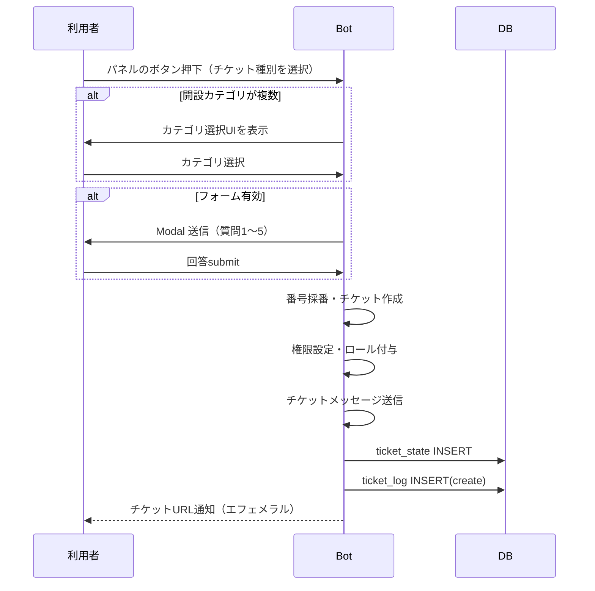
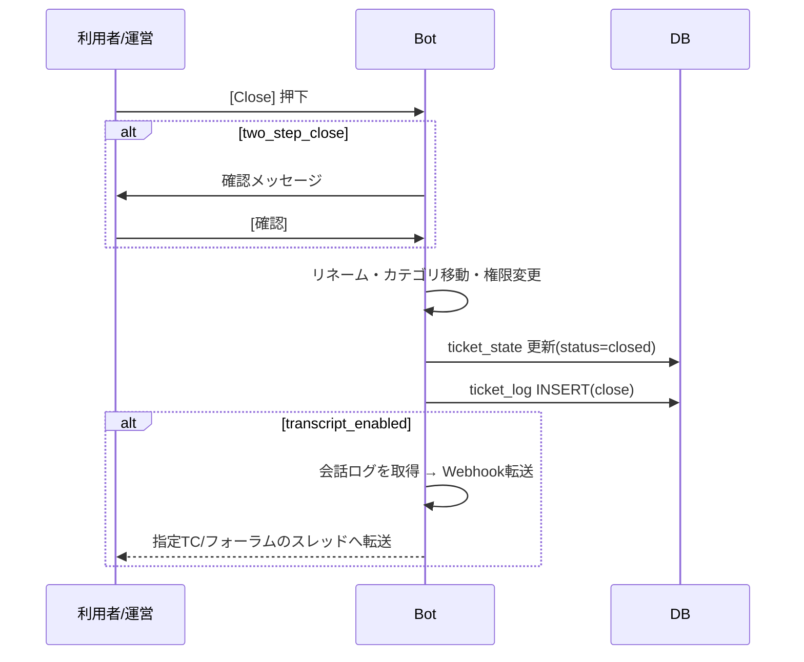

# チケット機能（ticket_cog）仕様書

> **作成日**: 2026-09-06
> **バージョン**: 0.1.0（草案）
> **ステータス**: 依頼者レビュー待ち
> **参考**: [Ticket Tool Docs](https://docs.tickettool.xyz/)

---

## 1. 概要

### 1.1 機能の目的

サーバー内で**サポートチケット**を開設・運営するための機能です。
運営スタッフと利用者が、個別のプライベートチャンネル（チケット）で
1対1のやり取りを行うことを可能にします。

Ticket Tool では**ダッシュボード（Web）**から設定を行いますが、
本実装では**Discord コマンドのみで完結**させます。
管理画面はエフェメラルメッセージ上に表示し、Component v2
（Modal / Select / Checkbox / Label 等）を活用して直感的に
設定できるようにします。

### 1.2 用語定義

| 用語 | 説明 |
|---|---|
| **パネル** | チケット作成の入口。**複数のボタン**を配置したメッセージとして `#チケット` 等のチャンネルに設置する |
| **ボタン（チケット種別）** | パネル内の1ボタン。**それぞれ異なる内容（カテゴリ・フォーム・メッセージ等）でチケットを発行**できる |
| **チケット** | ボタンから生成されるプライベートチャンネル（カテゴリ配下） |
| **チケットオーナー** | チケットを開いたユーザー |
| **サポートチームロール** | 全チケットに参加権限を持つロール（運営ロール） |
| **追加ロール** | サポートチームとは別の権限グループ（閲覧のみ等）。オブザーバー用途 |
| **クローズ（Closed）** | チケットを閉じた状態。チャンネルは残り、閲覧のみ可能 |
| **削除（Deleted）** | チケットチャンネルを削除した状態。トランスクリプト（会話ログ）を転送してから削除する |
| **トランスクリプト** | チケット内の会話ログ。**指定TC/フォーラム内のスレッドに Webhook 転送**する（HTML生成は行わない） |

### 1.3 前提条件（必要な権限）

| 権限 | 用途 |
|---|---|
| `Manage Channels` | チケットチャンネルの作成・削除・リネーム |
| `Manage Roles` / `Manage Permissions` | チャンネル権限付与（オーバーライド設定） |
| `Embed Links` | Embed メッセージ送信 |
| `Manage Webhooks` | トランスクリプト転送用 Webhook の作成・実行 |
| `Create Public/Private Threads` | トランスクリプト転送先スレッドの作成 |
| `Manage Threads` | 転送後のスレッド削除（設定時） |
| `Send Messages in Threads` 等 | スレッド型チケット利用時 |

---

## 2. 機能一覧

### 2.1 利用者向け機能

| No | 機能 | 説明 | 優先度 |
|---|---|---|---|
| U-01 | チケット作成 | パネル内の**任意のボタン**を押下。ボタンごとに内容（カテゴリ・フォーム）が異なる | ★★★ |
| U-02 | フォーム入力 | チケット作成前に質問フォーム（最大5問）へ回答 | ★★★ |
| U-03 | チケット一覧表示 | `/チケット 一覧` で自分が開いたチケットを表示 | ★★☆ |
| U-04 | チケットを閉じる | クローズボタンまたは `/チケット 閉じる` でクローズ | ★★★ |
| U-05 | チケットを開き直す | クローズ済みチケットを `/チケット 開き直す` で再オープン | ★★☆ |

### 2.2 サポートチーム向け機能（ボタン操作）

| No | 機能 | 説明 | 優先度 |
|---|---|---|---|
| M-01 | クレーム | `[Claim]` ボタンで対応者を宣言 | ★★★ |
| M-02 | クローズ | `[Close]` ボタンでクローズ（2段階確認あり） | ★★★ |
| M-03 | 削除 | `[Delete]` ボタンでチャンネル削除（トランスクリプト転送後） | ★★★ |
| M-04 | トランスクリプト転送 | `[Save Transcript]` で**指定TC/フォーラムのスレッドへWebhook転送** | ★★☆ |
| M-05 | メンバー追加 | `/チケット 追加 @user` でチケットに利用者を追加 | ★★☆ |
| M-06 | メンバー除外 | `/チケット 除外 @user` でチケットから利用者を除外 | ★★☆ |

### 2.3 管理者向け機能（パネル設定）

| No | 機能 | 説明 | 優先度 |
|---|---|---|---|
| A-01 | パネル作成 | パネルを新規作成（最大10個） | ★★★ |
| A-02 | パネル編集 | 各パネルの設定を編集 | ★★★ |
| A-03 | パネル削除・複製 | パネルの削除・複製 | ★★☆ |
| A-04 | パネル送信 | 指定チャンネルにパネルメッセージを送信 | ★★★ |
| A-05 | パネル更新 | 設置済みパネルメッセージを最新設定へ更新 | ★★☆ |
| A-06 | パネル有効/無効 | パネル単位のON/OFF | ★★★ |
| A-07 | ボタン管理 | パネル内ボタンの追加・編集・削除・並べ替え（各ボタン＝チケット種別） | ★★★ |

### 2.4 自動処理

| No | 機能 | 説明 | 優先度 |
|---|---|---|---|
| S-01 | チケット番号採番 | **ボタンごと**の連番（`{count}` 変数） | ★★★ |
| S-02 | チケット名自動生成 | `ticket-{count}` / `ticket-{username}` 形式で自動命名 | ★★★ |
| S-03 | ログ記録 | 開設・クローズ・削除・クレーム等の操作ログを記録 | ★★☆ |
| S-04 | ログ送信 | ログチャンネルへ操作ログを送信（設定時） | ★★☆ |
| S-05 | トランスクリプト自動転送 | クローズ・削除時に**指定TC/フォーラムのスレッドへWebhook転送**（設定時） | ★★☆ |

---

## 3. コマンド一覧

### 3.1 `/チケット` グループ

```text
/チケット パネル          … パネル管理パネルを表示（管理者）
/チケット 一覧            … 自分のチケット一覧を表示（全員）
/チケット 開く            … コマンド起動でチケットを開く（任意のパネル指定）
/チケット 閉じる          … 現在のチケットをクローズ
/チケット 開き直す        … クローズ済みチケットを再オープン
/チケット 追加 @user      … チケットに利用者を追加（サポートチーム）
/チケット 除外 @user      … チケットから利用者を除外（サポートチーム）
/チケット クレーム        … 対応者を宣言（サポートチーム）
/チケット トランスクリプト … 現在のチケットのログをWebhook転送（サポートチーム）
```

> **実装時のコマンド名**（スラッシュコマンドは英語名で登録）:
> `ticket-panel` / `ticket` グループ（`list` / `open` / `close` / `open-again` /
> `add @user` / `remove @user` / `claim` / `transcript`）

### 3.2 権限

| コマンド | 権限 |
|---|---|
| `/チケット パネル` | 管理者（`administrator=True` デフォルト） |
| `/チケット 閉じる` 等 | チケット内操作。オーナー or サポートチームロール or 対象チャンネルの `Manage Channels` 保持者 |
| `/チケット 追加 / 除外 / クレーム / トランスクリプト` | サポートチームロール or `Manage Channels` 保持者 |

---

## 4. パネル設定項目（Ticket Tool 対応表）

Ticket Tool のダッシュボード設定との対応と、実装可否を下表に示します。

### 4.1 一般設定（General Options）

| Ticket Tool項目 | 本実装 | 備考 |
|---|---|---|
| パネル名 | ✅ `name` | 一意名。複製時に `（コピー）` を付与 |
| パネル内ボタン | ✅ `buttons` | **1パネルに複数ボタン（＝チケット種別）。上限は Discord の1行ボタン数（5個）を初期値とし、将来変更可能な定数で管理** |
| 同時オープン数上限（ボタン） | ✅ ボタン単位 `max_open_per_button` | デフォルト **1** |
| 同時オープン数上限（パネル） | ✅ ボタン単位 `max_open_per_panel`（当該パネル内合計） | デフォルト **5** |
| 同時オープン数上限（サーバー） | ✅ パネル共通 `max_open_per_server` | デフォルト **10** |
| サポートチームロール | ✅ ボタン単位 `support_role_ids` | 複数選択（RoleSelect・max 5） |
| 追加ロール | ✅ ボタン単位 `extra_role_ids` | 複数選択（RoleSelect・max 5） |
| チケット番号パディング | ✅ ボタン単位 `count_padding` | 0〜10（デフォルト 0） |
| Two Step Close | ✅ パネル共通 `two_step_close` | クローズ確認画面の有無（デフォルト ON） |
| Two Step Ticket（クローズ状態保持） | ✅ パネル共通 `two_step_ticket` | クローズ状態を保持して削除を別操作にする（デフォルト ON） |
| Auto Pin Ticket | ✅ パネル共通 `auto_pin` | 開設メッセージのピン留め（デフォルト OFF） |

### 4.2 カテゴリ設定（Category Options）

| Ticket Tool項目 | 本実装 | 備考 |
|---|---|---|
| 開設カテゴリ | ✅ ボタン単位 `category_ids`（**複数指定可**） | チケットを生成するカテゴリ。複数指定時は**作成時に選択UI**を表示 |
| クローズ済みカテゴリ | ✅ ボタン単位 `closed_category_ids`（**複数指定可**） | クローズ時に移動するカテゴリ。開設カテゴリと**インデックスで対応**（6.2.1 参照） |

### 4.3 チケット設定（Ticket Options）

| Ticket Tool項目 | 本実装 | 備考 |
|---|---|---|
| チケットメッセージ | ✅ ボタン単位 `ticket_message` | Embed説明。変数対応（後述） |
| クローズ確認メッセージ | ✅ ボタン単位 `close_message` | 2段階クローズ時の確認文言 |
| 開設時チャンネル名 | ✅ ボタン単位 `open_channel_name` | `ticket-{count}` 等。変数対応 |
| クローズ時チャンネル名 | ✅ ボタン単位 `closed_channel_name` | `closed-{count}` 等 |
| 開設時ロール付与/剥奪 | ✅ ボタン単位 `open_add_role_ids` / `open_remove_role_ids` | オーナーに対して実行 |
| クローズ時ロール付与/剥奪 | ✅ ボタン単位 `close_add_role_ids` / `close_remove_role_ids` | 同上 |

### 4.4 フォーム設定（Form Options）

| Ticket Tool項目 | 本実装 | 備考 |
|---|---|---|
| フォーム有効化 | ✅ ボタン単位 `form_enabled` | |
| フォームタイトル | ✅ ボタン単位 `form_title` | Modal タイトル |
| 質問（最大5問） | ✅ ボタン単位 `form_questions` | 各 `{label, placeholder, required, multiline, min, max}` |
| 回答を自動表示 | ✅ ボタン単位 `form_auto_show` | チケットメッセージに回答Embedを付与 |

### 4.5 権限設定（Permission Options）

| Ticket Tool項目 | 本実装 | 備考 |
|---|---|---|
| オープン時 サポートチーム権限 | ✅ 固定 `ViewChannel + SendMessages` | 詳細は将来拡張 |
| オープン時 オーナー権限 | ✅ 固定 `ViewChannel + SendMessages` | 同上 |
| オープン時 @everyone | ✅ 固定 `ViewChannel 剥奪` | 同上 |
| クローズ時 参加者権限 | ✅ 固定 `SendMessages 剥奪・ViewChannel維持` | 同上 |

### 4.6 ボタン・メッセージ（Button / Message Options）

| Ticket Tool項目 | 本実装 | 備考 |
|---|---|---|
| パネルメッセージ内容 | ✅ パネル共通 `panel_content` / `panel_embed_desc` | パネルメッセージの文言 |
| パネルボタン | ✅ ボタンごと `label` + `emoji` | **1パネルに最大5個**。各ボタンが独立したチケット種別 |
| ボタン並び順 | ✅ `buttons` 配列順 | View の追加順に行単位で配置（1行5個まで） |
| Close/Claim ボタン表示 | ✅ 固定表示 | ボタンON/OFF切替は将来拡張 |

### 4.7 その他（本実装独自）

| Ticket Tool項目 | 本実装 | 備考 |
|---|---|---|
| ログチャンネル | ✅ パネル共通 `log_channel_id` | 操作ログ送信先（未設定なら記録のみ） |
| トランスクリプト転送 | ✅ パネル共通 `transcript_enabled` | クローズ/削除時に**指定TC/フォーラムのスレッドへWebhook転送** |
| 転送先TC/フォーラム | ✅ パネル共通 `transcript_channel_id` | スレッド作成先（テキストチャンネル or フォーラム） |
| スレッド名 | ✅ パネル共通 `transcript_thread_name` | 変数対応。デフォルト `transcript-{usernickname}-{count}` |
| 転送後スレッド削除 | ✅ パネル共通 `transcript_delete_thread` | デフォルト OFF（スレッドを残す） |

---

## 5. データ設計

### 5.1 テーブル定義

**<u>テーブル 1: `ticket_panel_settings`（パネル設定）</u>**

```sql
CREATE TABLE IF NOT EXISTS ticket_panel_settings (
    guild_id    BIGINT NOT NULL,
    panel_id    INT    NOT NULL,      -- ギルド内連番 (0〜)
    settings    JSON   NOT NULL,      -- TicketPanelSetting 直列化
    PRIMARY KEY (guild_id, panel_id)
);
```

**<u>テーブル 2: `ticket_state`（チケット状態管理）</u>**

```sql
CREATE TABLE IF NOT EXISTS ticket_state (
    guild_id    BIGINT NOT NULL,
    channel_id  BIGINT NOT NULL,      -- チケットチャンネルID
    panel_id    INT    NOT NULL,      -- どのパネル由来か
    button_id   INT    NOT NULL,      -- どのボタン（チケット種別）由来か
    category_id BIGINT NOT NULL,      -- どの開設カテゴリに作ったか
    owner_id    BIGINT NOT NULL,      -- オーナー（チケットを開いたユーザー）
    number      INT    NOT NULL,      -- ボタン内連番（{count}）
    status      VARCHAR(16) NOT NULL, -- open | closed | deleted
    claimed_by  BIGINT NULL,          -- クレームした運営者
    opened_at   DATETIME NOT NULL,
    closed_at   DATETIME NULL,
    PRIMARY KEY (guild_id, channel_id)
);
```

**<u>テーブル 3: `ticket_log`（操作ログ）</u>**

```sql
CREATE TABLE IF NOT EXISTS ticket_log (
    id          BIGINT AUTO_INCREMENT PRIMARY KEY,
    guild_id    BIGINT NOT NULL,
    channel_id  BIGINT NOT NULL,
    panel_id    INT    NULL,
    action      VARCHAR(32) NOT NULL, -- create|claim|close|reopen|delete|transcript|add|remove
    actor_id    BIGINT NOT NULL,
    target_id   BIGINT NULL,
    created_at  DATETIME NOT NULL
);
```

### 5.2 データクラス

ProfileJudgingCog の `JudgingSetting` と同じ方式（`__init__` で全項目、JSON エンコーダで直列化）を踏襲します。
**パネル（1）─ ボタン（複数）** の2階層構造です。

```python
class TicketButtonSetting:
    """パネル内の1ボタン（＝チケット種別）"""
    # 基本
    id: int                    # パネル内ボタンID (0〜)
    label: str                 # ボタンラベル（例「🎫 雑談相談」）
    emoji: str                 # ボタン絵文字（空可）
    enabled: bool              # 有効/無効（無効ならパネルに非表示）

    # 一般
    support_role_ids: list[int]   # サポートチームロール（このボタン用）
    extra_role_ids: list[int]     # 追加ロール（オブザーバー等）
    count_padding: int            # 番号パディング (0〜10)
    max_open_per_button: int      # 同時オープン数上限（ボタン）デフォルト1
    max_open_per_panel: int       # 同時オープン数上限（パネル）デフォルト5

    # カテゴリ（複数指定可）
    category_ids: list[int]       # 開設カテゴリ（複数可）
    closed_category_ids: list[int]# クローズ時カテゴリ（複数可）

    # メッセージ
    ticket_message: str           # チケット開設時メッセージ
    close_message: str            # クローズ確認メッセージ

    # チャンネル名
    open_channel_name: str        # 例 "ticket-{count}"
    closed_channel_name: str      # 例 "closed-{count}"

    # ロール付与・剥奪
    open_add_role_ids: list[int]
    open_remove_role_ids: list[int]
    close_add_role_ids: list[int]
    close_remove_role_ids: list[int]

    # フォーム
    form_enabled: bool
    form_title: str
    form_auto_show: bool
    form_questions: list[dict]    # [{label, placeholder, required,
                                 #   multiline, min, max}] 最大5件

    # 番号管理
    ticket_count: int             # 採番用（ボタン内連番）


class TicketPanelSetting:
    """パネル（チケット作成の入口メッセージ）"""
    # 基本
    id: int                    # パネルID (ギルド内連番)
    name: str                  # パネル名（一意）
    enabled: bool              # 有効/無効
    buttons: list[TicketButtonSetting]  # パネル内ボタン（最大5個）

    # パネルメッセージ
    panel_content: str            # パネルメッセージ本文
    panel_embed_desc: str         # パネルEmbed説明

    # パネル共通設定
    two_step_close: bool          # クローズ確認あり
    two_step_ticket: bool         # クローズ状態を保持して削除を別操作にする
    auto_pin: bool                # 開設メッセージをピン留め
    log_channel_id: int           # ログ送信先（0=記録のみ）

    # トランスクリプト転送
    transcript_enabled: bool      # 有効/無効
    transcript_channel_id: int    # 転送先TC or フォーラムID
    transcript_thread_name: str   # スレッド名（変数対応）
    transcript_delete_thread: bool # 転送後にスレッドを削除するか

    # サーバー上限
    max_open_per_server: int      # 同時オープン数上限（サーバー）デフォルト10
```

### 5.2.1 同時オープン数上限（3段階）

上限は**ボタン / パネル / サーバー**の3段階で設定でき、**すべての条件を同時に満たす**必要があります。
いずれか1つでも上限に達している場合は新規チケットを作成できません。

| 段階 | 設定 | デフォルト | 判定対象 |
|---|---|---|---|
| ① ボタン | `max_open_per_button` | **1** | 同じボタン（チケット種別）で `status=open` のチケット数 |
| ② パネル | `max_open_per_panel` | **5** | 同じパネルの全ボタン合計で `status=open` のチケット数 |
| ③ サーバー | `max_open_per_server` | **10** | サーバー全体で `status=open` のチケット数 |

- 数値はパネル共通/ボタン単位で編集可能（将来変更を見据えた定数管理）。
- `0` を指定した場合は「上限なし」とみなします。

### 5.2.2 トランスクリプト転送の仕様

TicketTool のトランスクリプト保存方式を踏襲し、**HTMLファイル生成ではなく**
**指定TC/フォーラム内にスレッドを作成し、Webhook で会話ログを転送**します。

| 項目 | 内容 |
|---|---|
| 転送先 | `transcript_channel_id` で指定した **テキストチャンネル or フォーラム** |
| スレッド名 | `transcript_thread_name`（変数対応、デフォルト `transcript-{usernickname}-{count}`） |
| 送信方式 | **Webhook 送信**（発言者の**表示名・アイコン**を対応させて転送） |
| **転送単位** | **メッセージ単位**（チケット内の各メッセージを1件ずつ時系列で転送） |
| 転送後スレッド | `transcript_delete_thread` が ON なら削除 / OFF なら残す（デフォルト OFF） |
| 長文分割 | ニトロ等で 1 メッセージが 2000 文字を超える場合は分割送信（下記） |

**転送単位（メッセージ単位）の詳細**

- チケット内のメッセージを `history()` で古い順に取得し、**1メッセージ = 1投稿**として転送します
- 各投稿は発言者の表示名・アイコンを Webhook で再現します
- ボットのメッセージ（システム系・開設メッセージ）は必要に応じて除外または通常投稿します
- 画像・Embed が含まれるメッセージは、本文とともに必要な情報を転送します（詳細は実装時に決定）

**実装時の決定事項（Phase 7）**

- ボットメッセージ（開設メッセージ含む）は **除外**（スキップ）します
- 添付ファイルは**1メッセージにつき最大10件**をWebhookの `files` として転送します
  （Discord のEmbed制限に合わせて `attachment.read()` で取得）
- Embed は**タイトル・説明・フィールド・フッター・画像・サムネイル・著者**を再現します
  （最大10個。`embeds` に再構築して転送）
- 転送するメッセージが長文分割された場合、**1つ目の断片のみ**Embed・添付を付与します（重複防止）
- `history()` は **`limit=None`（全件）** で古い順に取得します

**長文メッセージの分割ルール（2000文字制限時）**

1. まず**直近の改行位置（`\n`）**を探して分割（行単位で自然に切れる場所を優先）
2. 改行が無い、または改行位置で切っても次の断片がまだ 2000 文字を超える場合は
   **文中で分割**（2000文字ちょうどで切る）
3. 分割した各断片は**同じ Webhook（同一発言者名・アイコン）**で連続投稿
4. 1メッセージ目に `(1/2)` のような分割マーカーは付けず、自然な分割のみ行う（任意）

```python
# 分割ロジック（イメージ）
def split_transcript_text(text: str, limit: int = 2000) -> list[str]:
    if len(text) <= limit:
        return [text]
    parts = []
    rest = text
    while len(rest) > limit:
        # ① 改行位置で分割を試みる
        cut = rest.rfind("\n", 0, limit)
        if cut == -1:
            cut = limit  # ② 改行が無ければ文中で分割
        parts.append(rest[:cut])
        rest = rest[cut:]
    parts.append(rest)
    return parts
```

### 5.2.3 `ticket_state` に `deleted` レコードを残す理由

`status=deleted` のレコードを**残す**設計とします。

- チャンネル削除後も **`deleted` のまま履歴を保持**することで、
  「いつ・誰が・どのチケットを・どこへ転送したか」の**監査証跡**を失いません。
- トランスクリプトの**再転送・参照**が可能（`ticket_log` の `transcript` 記録と突き合わせ）。
- `/チケット 一覧` などで**削除済みチケットの情報**を表示できます。
- 削除操作時は `ticket_log` に `delete` を記録し、`ticket_state.status = deleted` に更新します。
- 転送先スレッド情報（スレッドID等）を `ticket_state` に併記することで、後から追跡可能です。

### 5.3 プレースホルダー変数（Supported Variables）

Ticket Tool の `{variables}` を踏襲。パネルメッセージ・チケットメッセージ・
チャンネル名で使用できます。

| 変数 | 内容 |
|---|---|
| `{count}` | チケット番号（パディング適用後） |
| `{user}` | オーナーのメンション |
| `{username}` | オーナーのユーザー名 |
| `{usernickname}` | オーナーのサーバー内表示名 |
| `{userid}` | オーナーのユーザーID |
| `{panel}` | パネル名 |
| `{guild}` | サーバー名 |
| `{create.form.1}` 〜 `{create.form.5}` | フォーム回答（1問目〜5問目） |
| `{reason}` | コマンド起動のチケット開設時、理由（`/チケット 開く` 引数） |
| `{button}` | ボタン（チケット種別）のラベル |
| `{buttonid}` | ボタンID |

例）チャンネル名: `ticket-{count}` → `ticket-0005`

---

## 6. UI / 操作フロー設計

### 6.1 パネル管理画面（`/チケット パネル`）

- **表示**: エフェメラル。パネル一覧を Paginator でページング
  （既存 `Paginator` を流用、`profile_judging_cog` の方式を踏襲）
- **Embed**: パネル名・有効/無効・ボタン一覧・開設カテゴリ・フォーム有無 を表示

| ボタン | 動作 |
|---|---|
| ➕ 新規作成 | 新規パネル編集画面へ |
| ⚙️ 編集 | 選択中パネルの編集画面へ |
| 📝 別名で保存 | 選択中パネルを複製して新規保存 |
| 🗑 削除 | 削除確認後、パネルを削除 |
| 📤 パネル送信 | 送信先チャンネル選択 → パネルメッセージ送信 |
| 🔁 パネル更新 | メッセージURL指定で該当メッセージを再送信（上書き） |
| 🔃 有効/無効 | パネルの ON/OFF トグル |

### 6.1.1 パネル編集画面（2階層構造）

パネル編集は `profile_judging_cog` の `go_to_judging_setting`（編集中ビュー）と同じ
**「ダーティフラグ + 💾保存」方式**を踏襲し、**パネル → ボタン** の2階層で編集します。

```
[パネル編集画面]
  ├─ パネル名 / パネルメッセージ / パネル共通設定（2段階クローズ等）
  ├─ ➕ ボタン追加    （最大5個まで）
  ├─ [ボタン1] ★ 雑談相談      → ボタン編集画面へ
  ├─ [ボタン2] 🛠 トラブル報告  → ボタン編集画面へ
  └─ 💾 保存 / 🔃 有効トグル / ⬅ 戻る
```

ボタン編集画面では、各設定ボタンから Modal / Select を開きます。

### 6.2 ボタン編集画面（チケット種別ごとの設定）

`profile_judging_cog` の `go_to_judging_setting`（編集中ビュー）と同じ
**「ダーティフラグ + 💾保存」方式**を踏襲します。

- Embed カラー: 保存済み `🟢` / 未保存（ダーティ）`🔴`
- 下部に `💾 保存` / `🔃 有効トグル` / `⬅ 戻る` の常設ボタン
- 各設定ボタンから Modal / Select を開く

| ボタン | 内容 | 使用コンポーネント |
|---|---|---|
| ボタン外観 | ラベル・絵文字 | Modal（TextInput × 2） |
| ロール設定 | サポートチーム / 追加ロール | Modal（RoleSelect × 2） |
| カテゴリ設定 | 開設カテゴリ / クローズ先カテゴリ | Modal（ChannelSelect × 2, **複数選択**） |
| メッセージ設定 | チケット文言・クローズ確認文言・チャンネル名 | Modal（TextInput × 4, マルチライン） |
| ロール付与設定 | 開設時/クローズ時 付与・剥奪 | Modal（RoleSelect × 4） |
| フォーム設定 | フォーム有効化・タイトル・質問編集 | Modal（TextInput + 質問は別途編集UI） |
| 番号パディング | チケット番号の桁数 | Modal（TextInput × 1） |
| 同時オープン上限 | ボタン/パネルの同時上限数 | Modal（TextInput × 2） |

**パネル編集画面に追加する設定**（パネルレベル・`2段階クローズ`等と同列）:

| ボタン | 内容 | 使用コンポーネント |
|---|---|---|
| サーバー上限 | サーバー全体の同時オープン上限数 | Modal（TextInput × 1） |
| トランスクリプト設定 | 転送有効化・転送先TC/フォーラム・スレッド名・転送後削除 | Modal（ChannelSelect + TextInput × 2 + CheckboxGroup） |

> **Modal 制約（discord-modal-chain-restriction.md 準拠）**
> - Modal 内のコンポーネントは `{4,5,6,7,10,12}` 系に限定。
>   ここでは TextInput / ChannelSelect / RoleSelect / CheckboxGroup を利用。
> - 1 Modal に追加できるのは **5 アイテムまで**。
>   → 上表は 3〜4 アイテム構成に抑える（5を超える場合は複数 Modal に分割）。
> - Modal → Modal の直接遷移は不可。編集画面の各ボタンから独立して開く。
> - Select 系で「未選択OK」にしたい場合は `min_values=0` + `required=False` を必ず併用。

### 6.2.1 カテゴリ複数指定の対応ルール

- **開設カテゴリ**は複数指定可能（ChannelSelect `max_values` で制限）。
  複数指定時、**チケット作成時にどのカテゴリで開くか選択UI（Select）を利用者へ提示**します。
  （カテゴリの意味 = チケット種別の分類。例：相談 / 報告 / 申請 でフォルダ分け）
- **クローズ済みカテゴリ**も複数指定可能。開設カテゴリと**インデックスで対応**し、
  クローズ時に元の開設カテゴリと同じインデックスのクローズ先へ移動します。

| 開設カテゴリ（設定） | クローズ済みカテゴリ（設定） | 作成時 | クローズ時 |
|---|---|---|---|
| `[A, B]` | `[X, Y]` | A or B を選択 → そのインデックスを記録 | A→X / B→Y へ移動 |
| `[A]` | `[X]` | A に作成 | A→X へ移動 |
| `[A, B]` | `[X]` | A or B を選択 | どちらも X へ移動 |
| `[A, B]` | `[]`（未設定） | A or B を選択 | 移動しない（元の位置に残留） |
| `[A]` | `[Y]`（開設より多い） | A に作成 | Y へ移動 |

- クローズ先が未設定（`closed_category_ids` 空）の場合はカテゴリ移動を行いません。
- クローズ先が不足する場合は、末尾のカテゴリを最終のクローズ先として使用します。
- 作成時に選択されたカテゴリのインデックスは `ticket_state.category_id` で記録済みのため、
  再オープン時も同じ対応ルールで復元できます。

### 6.3 チケット作成フロー（パネルから）

```
1. 利用者: パネル内のボタンのいずれかを押下（例：「🛠 トラブル報告」）
2. Bot:
   a. 押されたボタン（チケット種別）を特定
   b. ボタンが無効なら拒否
   c. チケット数制限チェック（**ボタン / パネル / サーバー の3段階**・5.2.1 参照）
   d. 開設カテゴリが複数なら**どのカテゴリで開くか選択UI**を表示
   e. フォーム有効なら Modal 送信（最大5問）
3. 利用者: カテゴリ選択（複数時のみ）→ フォーム回答（ありの場合）→ 送信
4. Bot:
   a. 番号採番（{count}: ボタンごと）
   b. 選択カテゴリ配下にチケットチャンネル作成
      （名前: open_channel_name を変数展開）
   c. 権限オーバーライド適用
      - @everyone: ViewChannel 剥奪
      - オーナー: ViewChannel + SendMessages 付与
      - サポートチーム: ViewChannel + SendMessages 付与
      - 追加ロール: ViewChannel 付与（SendMessages なし）
   d. ロール付与・剥奪（オーナー対象）
   e. チケットメッセージ送信
      （内容: ticket_message + フォーム回答Embed［form_auto_show 時］
       ボタン: [Close] [Claim]）
   f. auto_pin ならメッセージをピン留め
   g. ログ記録・ログ送信（panel_id + button_id + category_id を記録）
5. 利用者/運営: チケット内で会話
```

### 6.5 チケット内ボタン

チケット開設メッセージに含めるボタン（`ticket_ui` View）:

| ボタン | 対象 | 動作 |
|---|---|---|
| 緑「✅ 閉じる」 | 全員 | クローズ確認（`two_step_close`）→ クローズ |
| 青「🙋 クレーム」 | サポートチーム | 対応者を宣言（claim） |
| 黄「📁 トランスクリプト転送」 | サポートチーム | 指定TC/フォーラムのスレッドへWebhook転送 |

**クローズ済みチケットの場合**（`two_step_ticket` = ON）:

| ボタン | 対象 | 動作 |
|---|---|---|
| 緑「🔓 開き直す」 | 全員 | 再オープン |
| 赤「🗑 削除」 | サポートチーム | トランスクリプト転送後、チャンネル削除 |
| 黄「📁 トランスクリプト転送」 | サポートチーム | 指定TC/フォーラムのスレッドへWebhook転送 |

### 6.6 クローズフロー

```
[Close] 押下
  ├─ two_step_close = ON: 確認Embed（[確認] / [キャンセル]）→ 確認でクローズ
  └─ two_step_close = OFF: 即クローズ

クローズ処理:
  a. チャンネル名 → closed_channel_name
  b. カテゴリ移動: ticket_state に記録された開設カテゴリのインデックスに対応する
     closed_category_ids のカテゴリへ移動（未設定なら移動しない・6.2.1 参照）
  c. 権限変更: 通常参加者 SendMessages 剥奪（ViewChannel 維持）
  d. オーナーのロール付与・剥奪
  e. ボタンView → クローズ用Viewへ差し替え
  f. ログ記録・送信
```

> チャンネル名リネームは Discord のレートリミット（10分間に2回）に注意。
> エラー時はリネームをスキップして処理継続。

---

## 7. 処理フロー詳細

### 7.1 チケット作成（シーケンス）



### 7.2 クローズ（シーケンス）



---

## 8. キャッシュ・DB設計（既存コグ踏襲）

### 8.1 メモリキャッシュ

```python
# パネル設定（ギルドごと）
PANEL_SETTINGS: dict[int, dict[int, TicketPanelSetting]] = {}
PANEL_LOCKS: dict[int, asyncio.Lock] = {}       # ギルド別ロック

# チケット状態（チャンネルID → TicketState）
TICKET_STATES: dict[int, dict[int, TicketState]] = {}
```

- 起動時（`cog_load`）に全ギルド分を DB からメモリへロード
- 更新時はメモリ + DB の両方へ書き込み（`is_db_save` 方式）
- JSON シリアライズは `_TicketEncoder` / `object_hook` を実装
  （`judging_settings` と同じ `_type` 方式）
- ボタン上限・上限値は**定数で管理**（`MAX_BUTTONS_PER_PANEL = 5` 等）し、将来変更可能にする

### 8.2 既存コグとの整合

- `create_ticket_cog_tables()`：`cog_load` にてテーブル自動作成
- `get_panel_settings(guild_id)` / `set_panel_setting(...)` を実装
- `load_database(bot)`：起動時に全データ復元
- トランスクリプト転送はチケット内メッセージ履歴を `history()` で取得し
  指定TC/フォーラムのスレッドへ Webhook 送信する
  （`sticky_cog.send_message_from_json` の Webhook 実装パターンを踏襲）

---

## 9. エッジケース・制約

| 項番 | 内容 | 対応 |
|---|---|---|
| 1 | チケット数のサーバー・パネル上限 | **ボタン/パネル/サーバーの3段階**で判定（5.2.1）。超過時はエラー通知 |
| 2 | 他人のチケットへの参加 | `ticket_state.owner_id` と権限で判定 |
| 3 | クローズ後にオーナー離脱 | 管理者削除権限で継続操作可能 |
| 4 | ボットが権限不足 | エラーを catch して原因を明示（1.3 参照） |
| 5 | チャンネル名リネームのレートリミット | 10分間2回。失敗時はスキップ＋ログ |
| 6 | フォーム未回答の任意項目 | `required=False` + `min_values=0` の併用 |
| 7 | パネル削除時、そのパネル由来のチケット | チケットは維持（channel削除は対象外） |
| 8 | パネル再送信で古いパネルメッセージ | メッセージURL指定で上書き更新 |
| 9 | ボタン削除時に利用中 | 既存チケットは維持。パネルからボタンが消えるだけ |
| 10 | 再起動中のチケット状態 | `ticket_state` から復元。`open` のままのチャンネルはそのまま運用 |
| 11 | ボタン連打・同時押下 | ギルド別ロック + `ticket_state` 再取得で冪等化 |
| 12 | カテゴリ指定が不整合（開設側クローズ側の数不一致） | 6.2.1 の対応ルール表に従い、末尾カテゴリでフォールバック |
| 13 | 長文メッセージの分割（2000文字超過） | 改行位置優先 → 文中分割（5.2.2） |
| 14 | 転送先チャンネルがフォーラム | フォーラムの場合はスレッド/投稿として作成 |
| 15 | 転送後スレッド削除（ON時） | 転送完了後に削除。失敗時はログに残す |

---

## 10. ファイル構成（実装時）

```
utils/system_cogs/ticket_cog.py   # 本体（パネル管理UI・チケット作成・クローズ処理）
docs/features/ticket.md           # 本仕様書
```

> 他システムコグと同様、**1ファイル完結**（`utils/system_cogs/ticket_cog.py`）を
> 第一優先とします。依存が大きくなった場合のみ分割を検討します。

---

## 11. 実装順序（ロードマップ）

| フェーズ | 内容 | 備考 |
|---|---|---|
| Phase 1 | パネル CRUD（作成・編集・削除・複製）+ **ボタン管理（追加/編集/削除）** | 管理UI骨格 |
| Phase 2 | チケット作成（**ボタン別**種別・権限・番号採番・メッセージ） | コア機能 |
| Phase 3 | **カテゴリ複数指定**（選択UI + クローズ先対応） | カテゴリ設定 |
| Phase 4 | **3段階の同時オープン数上限**（ボタン/パネル/サーバー） | 上限管理 |
| Phase 5 | クローズ・再オープン・削除・クレーム | 運用機能 |
| Phase 6 | フォーム（Modal）対応 | `discord-modal-chain-restriction.md` 準拠 |
| Phase 7 | **トランスクリプト Webhook 転送**（スレッド作成・分割送信） | 監査機能 | 
| Phase 8 | `/チケット` グループコマンド（一覧/開く/閉じる/開き直す/追加/除外/クレーム/トランスクリプト） | 発展機能 ✅ 実装完了 |

---

## 12. 決定事項・未定事項

### 12.1 パネル内ボタン数の上限（決定済み）

- デフォルト上限は **5個**（Discord の1行ボタン数の上限と一致）
- **将来変更可能な定数**で管理する（`MAX_BUTTONS_PER_PANEL = 5`）

### 12.2 同時オープン数上限（決定済み）

- **ボタン / パネル / サーバー**の3段階で設定（5.2.1 参照）
- デフォルト: ボタン **1** / パネル **5** / サーバー **10**

### 12.3 トランスクリプト分割の転送単位（決定済み）

- **メッセージ単位**で転送する（チケット内の各メッセージを1件ずつ時系列で投稿）
- 1メッセージが2000文字を超える場合のみ分割（改行位置優先 → 文中分割・5.2.2）

### 12.4 `deleted` レコードの扱い（決定済み）

- `ticket_state` に **`deleted` レコードを残す**（監査証跡・トランスクリプト追跡のため）

### 12.5 パネル設置可能チャンネル数

- **不要**（1チャンネルあたりのパネル設置数に制限は設けない）

### 12.6 `/チケット 開く` の理由引数

- **不要**（コマンドスタイルのチケット開設は実装しない）